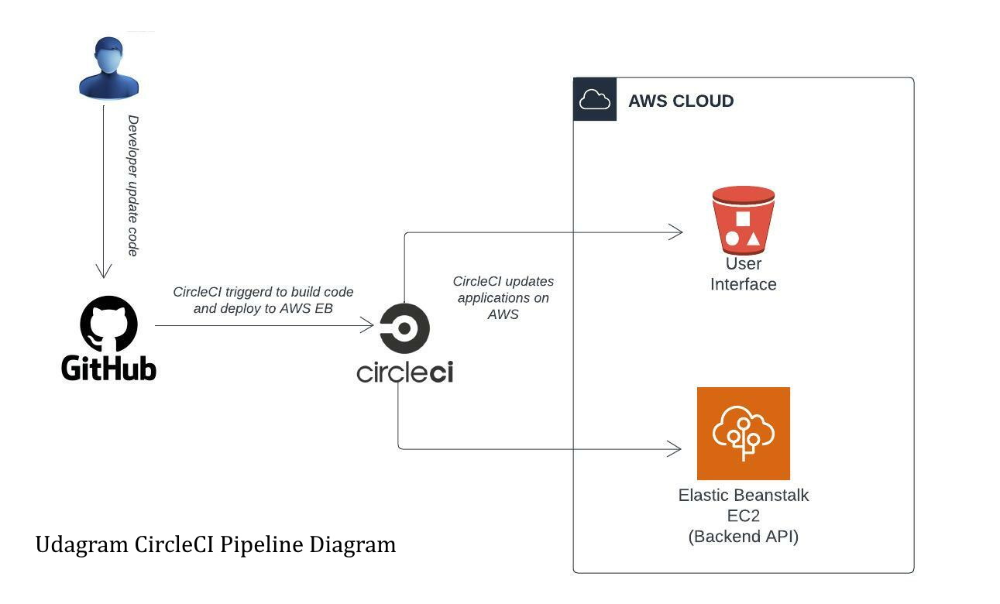

# Pipeline process

Before starting to work on automation process, insure that the frontend and backend working probably.
Test CircleCI config.yml code to insure its validity.




### Orbs

Here in the orb we stated that we will need node version 5.0.2, elastic-beanstalk cli version 2.0.1 and aws cli version 3.1.1

### Build job
In the build job we are using the docker image created by circlec
1. config.yml file start with installation of project dependencies like node
2. install dependencies for frontend with `npm run frontend:install`
3. install dependencies for backend with `npm run api:install`
4. build frontend app with `npm run frontend:build`
5. install backend api with `npm run api:build`

### Deploy job

after succefully installation and build process complete the deploy process start
1. the deploy job start with use the circleci docker image to install node, elastic beanstalk cli and the aws cli.
2. deploy environment variables to beanstalk application with executing  `bash udagram/udagram-api/bin/eb-env-sh`, the eb-env.sh reads it's variables form CircileCi context to secure application secrets and deploy to elastic beanstalk appliction using eb setenv command.

```
eb setenv POSTGRES_USERNAME=$POSTGRES_USERNAME 
eb setenv POSTGRES_PASSWORD=$POSTGRES_PASSWORD
eb setenv POSTGRES_DB=$POSTGRES_DB
eb setenv POSTGRES_HOST=$POSTGRES_HOST
eb setenv AWS_REGION=$AWS_REGION
eb setenv AWS_PROFILE=$AWS_PROFILE
eb setenv DB_PORT=$DB_PORT
eb setenv APP_PORT=$APP_PORT
eb setenv AWS_BUCKET=$AWS_BUCKET
eb setenv URL=$URL
eb setenv JWT_SECRET=$JWT_SECRET
eb setenv AWS_ACCESS_KEY_ID=$AWS_ACCESS_KEY_ID
eb setenv AWS_SECRET_ACCESS_KEY=$AWS_SECRET_ACCESS_KEY
```
3. finally deploying both applications with `npm run deploy`, this command will deploy frontend to S3 bucket and backend api to EC2 instance using the command `npm run deploy`.

### Workflow

In the workflow we are stating that we will first run the build job then wait for approval from the user the we specify that we only want to listen to the master branch then we run the deploy job. 
