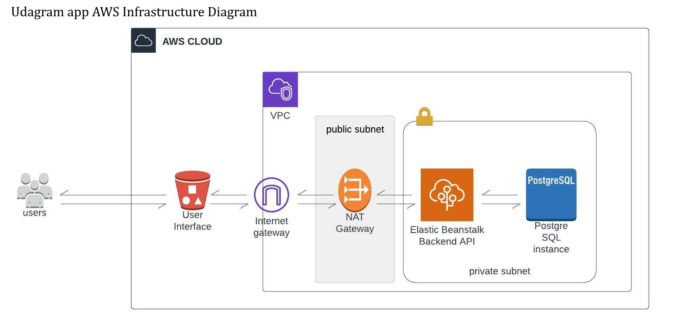

# Infrastructure of Udagram hoting on AWS

### Services used

1. Elastic Beanstalk service as orchestration service to create infrastructue of backend api hosting environment via initialization of many servieces like EC2 ,load balancer, VPC, NAT Gateway, EIP, and security groups
2. RDS Database service to create a postgreSQL database for data storage of our application.
3. S3 bucket for hosting the frontend UI and another bucket for beanstalk data and logs 

