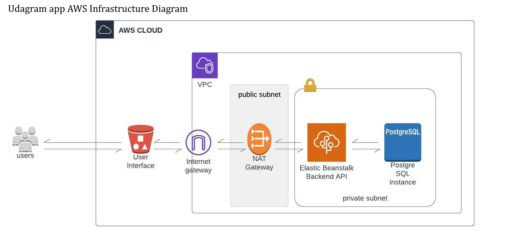
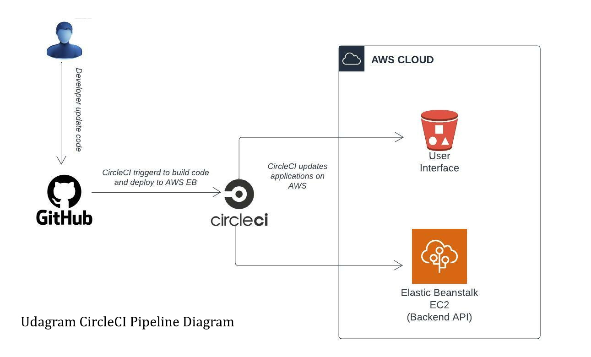

# Hosting a Full-Stack Application

 **This is the third project in Advanced Full-Stack Web Developer track in Udacity training.**

---


The purpose of this project to demonstrate how to take a newly developed Full-Stack application built for a retailer and deploy it to a cloud service provider so that it is available to customers. We used AWS console to start and configure the services the application needs such as elastic beanstack, RDS postgres database and S3 buckets to store product information and a web server allowing the site to be discovered by potential customers.





First project with the fixes uploaded to a github repository to integrate with CircleCI. CircleCI is used for CI/CD automation process by creating a pipleline with predefined environment variables in CircleCi organization settings context.





### Udagram

This application is provided by Udacity as a 3-tiers application (frontend, backend api and database) to demonstrate skills of hosting a full application probably. 


### AWS infrastrcture

- AWS S3 bucket to host frontend UI
- AWS elastic beanstack as an orchestration service to create EC2 instances, Loadbalancer, security gruops and more services to perfectly hose a backend api application.
- AWS RDS postgres database to act as application database


### Dependencies

```
- Node v14.15.1 (LTS) or more recent. While older versions can work it is advisable to keep node to latest LTS version

- npm 6.14.8 (LTS) or more recent

- AWS CLI v2

- EB CLI v1

- A RDS database running Postgres.

- A S3 bucket for hosting uploaded pictures.

```

for more iformations refer to
- [application pipline](/documentation/pipline.md) for pipeline process
- [Infrastructure Description](/documentation/InfrastructureDiscreption.md) for infrastructue description and 
- [Application Dependencies](/documentation/ApplicationDependencies.md) for application packages and dependencies
